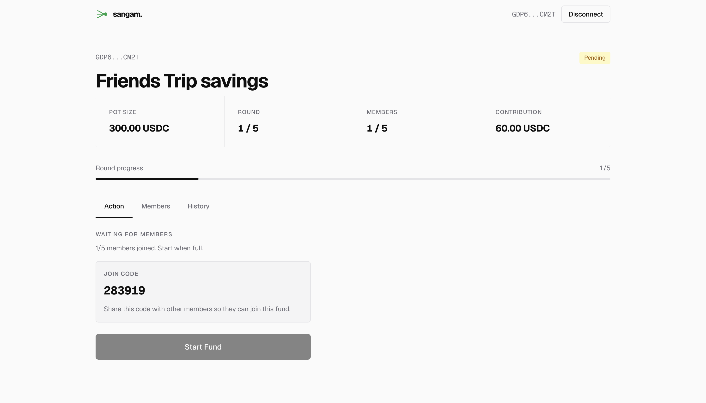
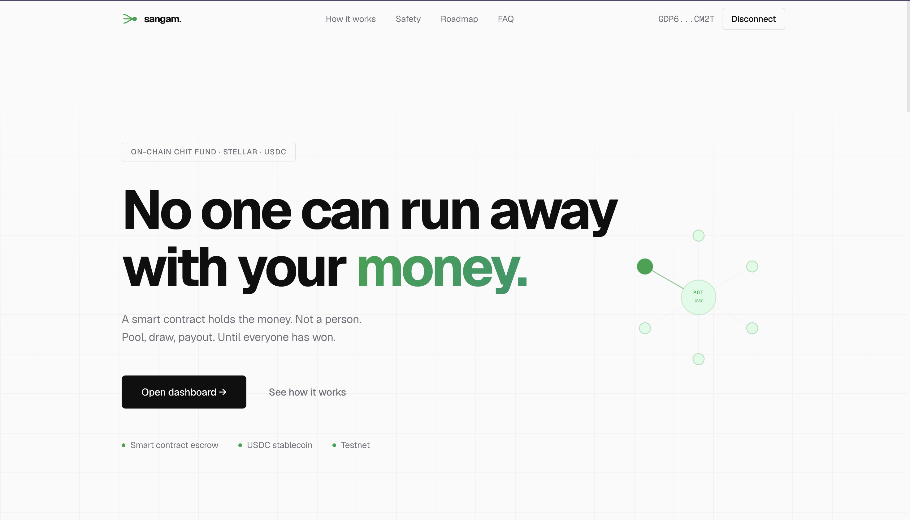
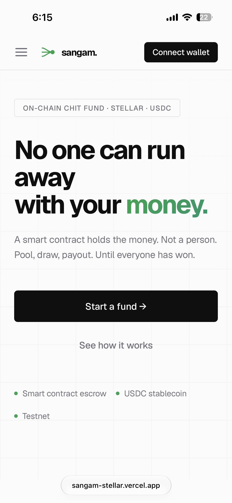
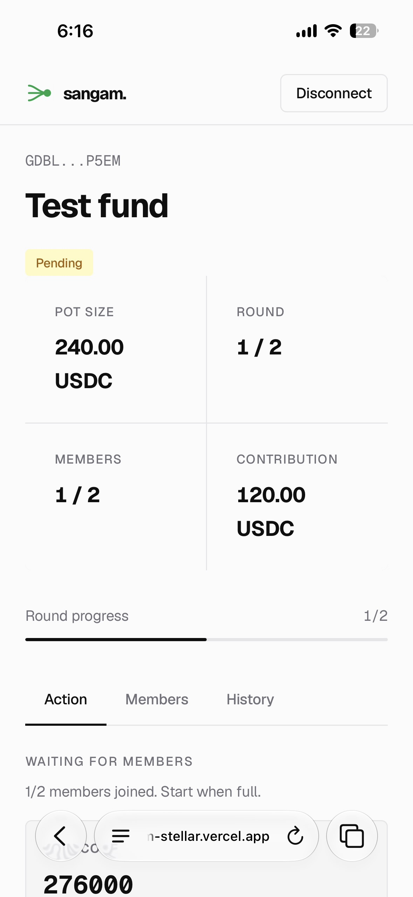

# sangam.

A decentralized ROSCA (Rotating Savings and Credit Association — aka *chit fund*, *committee*, *kye*, *tanda*, *susu*) built on the [Stellar](https://stellar.org/) network using [Soroban](https://soroban.stellar.org/) smart contracts and a [Next.js](https://nextjs.org/) frontend.

> *Sangam* (संगम) — Sanskrit for "confluence." A meeting of streams.

A group of 2–10 members each contribute a fixed amount every round. Each round, one member is selected at random (via a commit-reveal scheme that no one — including the organizer — can manipulate) and receives the entire pot. The cycle continues until every member has won exactly once.

- **No organizer custody.** The Soroban contract holds the pot — not a person.
- **Provably fair winner selection.** Each member commits a hashed secret, then reveals it. The contract XORs all revealed secrets to derive an unpredictable seed, then selects a winner from members who haven't won yet.
- **Cross-contract token transfers.** Contributions and payouts happen in a Stellar asset (currently a testnet "USDC" stub).

---

## Table of Contents

- [Screenshots](#screenshots)
- [Architecture](#architecture)
- [Fund Lifecycle](#fund-lifecycle)
- [Smart Contract API](#smart-contract-api)
- [Testnet Deployment](#testnet-deployment)
- [Project Structure](#project-structure)
- [Prerequisites](#prerequisites)
- [Running Locally](#running-locally)
- [Environment Variables](#environment-variables)
- [Building and Deploying the Contract](#building-and-deploying-the-contract)
- [Known Limitations](#known-limitations)

---

## Screenshots

<div align="center">
  <table>
    <tr>
      <td align="center">
        
        <br />
        <b>Dashboard</b>
      </td>
      <td align="center">
        
        <br />
        <b>Landing Page</b>
      </td>
    </tr>
    <tr>
      <td align="center">
        
        <br />
        <b>Mobile View 1</b>
      </td>
      <td align="center">
        
        <br />
        <b>Mobile View 2</b>
      </td>
    </tr>
  </table>
</div>

---

## Architecture

```
┌─────────────────────────────────────────────────────────────┐
│  Frontend (Next.js 16, App Router, React 19)                │
│                                                             │
│   src/app/page.tsx          ← landing page                  │
│   src/app/dashboard/        ← member dashboard              │
│   src/components/wallet/    ← StellarWalletsKit integration │
│   src/lib/contract.ts       ← typed RPC client              │
│   src/lib/stellar.ts        ← RPC config + formatting       │
└─────────────────────────────────┬───────────────────────────┘
                                  │ Soroban RPC
                                  ▼
┌─────────────────────────────────────────────────────────────┐
│  Soroban Contract (Rust, no_std)                            │
│                                                             │
│   contracts/chit-fund/src/lib.rs         ← public entry     │
│   contracts/chit-fund/src/chit_fund.rs   ← fund lifecycle   │
│   contracts/chit-fund/src/randomness.rs  ← commit-reveal    │
│   contracts/chit-fund/src/storage.rs     ← typed storage    │
└─────────────────────────────────┬───────────────────────────┘
                                  │ cross-contract call
                                  ▼
                       ┌──────────────────────┐
                       │  Stellar Asset / SAC │
                       │  (USDC stub on test) │
                       └──────────────────────┘
```

The contract is multi-tenant: a single deployed contract instance hosts arbitrarily many funds keyed by `fund_id: u64`. Members of different funds never interact.

---

## Fund Lifecycle

```
   create_fund                                claim_pot (final round)
      │                                                   │
      ▼                                                   ▼
  ┌─────────┐  activate_fund  ┌────────┐  all rounds  ┌──────────┐
  │ Pending │ ───────────────►│ Active │ ────────────►│ Completed│
  └─────────┘  (organizer)    └────────┘   complete   └──────────┘
       ▲
       │ join_fund
       │
   each member
```

Within an `Active` fund, every round runs through four phases, gated by the contract:

```
  ┌──────────┐    ┌──────────┐    ┌──────────┐    ┌──────────┐
  │ Deposit  │ ─► │ Commit   │ ─► │ Reveal   │ ─► │  Claim   │
  └──────────┘    └──────────┘    └──────────┘    └──────────┘
   each member     each member     each member     winner only
   transfers       posts           posts the       receives
   contribution    SHA-256(secret) secret;         entire pot;
                                   contract        round
                                   verifies hash   advances
                                   and XORs into
                                   accumulator
```

When the final member reveals, the contract derives a winner index from the accumulator and pushes the address onto `past_winners`. Only that address can `claim_pot`.

---

## Smart Contract API

All amounts are in stroops (`i128`, 7 decimals). All addresses are Stellar G… addresses.

| Method | Caller | Description |
|---|---|---|
| `create_fund(organizer, token, name, contribution, member_count)` | organizer | Creates a `Pending` fund. Organizer is auto-joined as member #1. Returns `fund_id: u64`. |
| `join_fund(fund_id, member)` | new member | Joins a `Pending` fund while slots remain. |
| `activate_fund(fund_id, organizer)` | organizer | Transitions `Pending → Active` once all slots are full. Round starts at 1. |
| `deposit(fund_id, member, amount)` | member | Transfers `amount` of the configured token into the contract. Must equal `contribution`. One per member per round. |
| `commit_hash(fund_id, member, hash)` | member | Submits `SHA-256(secret)` for this round. Only allowed once deposit phase is complete. |
| `reveal_hash(fund_id, member, secret)` | member | Reveals the preimage; contract verifies the hash and XORs `secret` into the round accumulator. The final reveal triggers winner selection. |
| `claim_pot(fund_id, winner)` | winner | Transfers the full pot to the winner and advances the round (or transitions to `Completed`). |
| `get_fund_summary(fund_id)` | anyone | Read-only: returns config, state, members, current round, past winners. |
| `get_round_summary(fund_id, round)` | anyone | Read-only: deposit / commit / reveal counts for a round. |
| `get_member_status(fund_id, member, round)` | anyone | Read-only: this member's deposit / commit / reveal flags for the round. |

Constraints enforced by the contract:

- `2 ≤ member_count ≤ 10`
- `contribution > 0`
- Deposits must equal `contribution` exactly
- Reveals must hash to the prior commitment
- A member cannot win twice in the same fund

---

## Testnet Deployment

The contract is deployed on Stellar testnet at:

- **Contract ID:** `CCHSYVP3YPWVVUCG6EPS2WTYPF4L6TLRXF4ZS7Z62PIEF5OIQJ36TMTR`
- **Asset ID (test USDC stub):** `CDLZFC3SYJYDZT7K67VZ75HPJVIEUVNIXF47ZG2FB2RMQQVU2HHGCYSC`
- **Network passphrase:** `Test SDF Network ; September 2015`
- **RPC:** `https://soroban-testnet.stellar.org`

You can inspect it on [Stellar Expert (testnet)](https://stellar.expert/explorer/testnet).

---

## Project Structure

```
ChitFund-dApp/
├── contracts/
│   └── chit-fund/
│       ├── Cargo.toml
│       └── src/
│           ├── lib.rs           ← contract entry, public methods
│           ├── chit_fund.rs     ← create/join/activate/deposit/claim
│           ├── randomness.rs    ← commit/reveal + winner selection
│           ├── storage.rs       ← persistent storage helpers
│           └── test.rs          ← contract tests
│
├── frontend/
│   ├── package.json
│   ├── next.config.ts
│   └── src/
│       ├── app/
│       │   ├── layout.tsx
│       │   ├── page.tsx              ← landing page
│       │   ├── globals.css           ← Tailwind v4 + design tokens
│       │   └── dashboard/page.tsx    ← member dashboard
│       ├── components/
│       │   ├── Navbar.tsx
│       │   ├── landing/              ← Hero, HowItWorks, FAQ, etc.
│       │   └── wallet/WalletProvider.tsx
│       ├── lib/
│       │   ├── contract.ts           ← typed contract client
│       │   └── stellar.ts            ← network/format helpers
│       └── types/index.ts
│
└── README.md
```

---

## Prerequisites

- **Node.js** 18+
- **npm** 9+ (the repo uses `package-lock.json`)
- **Rust** 1.74+ with the `wasm32-unknown-unknown` target
  ```bash
  rustup target add wasm32-unknown-unknown
  ```
- **Stellar CLI** for building/deploying the contract
  ```bash
  cargo install --locked stellar-cli --features opt
  ```
- A Stellar testnet wallet — [Freighter](https://www.freighter.app/) (browser), or a WalletConnect-compatible wallet on mobile.

---

## Running Locally

### 1. Frontend

```bash
cd frontend
npm install
cp .env.local.example .env.local   # if an example exists; otherwise see below
npm run dev
```

Open [http://localhost:3000](http://localhost:3000).

### 2. Smart Contract (development)

```bash
cd contracts/chit-fund
cargo build --target wasm32-unknown-unknown --release
```

> **Note:** The contract currently has no unit tests. The original `src/test.rs` targeted a pre-multi-fund API and was removed; a new suite covering the multi-fund flow still needs to be written.

---

## Environment Variables

Create `frontend/.env.local` with:

```bash
# Required: deployed Soroban contract IDs
NEXT_PUBLIC_CONTRACT_ID=CCHSYVP3YPWVVUCG6EPS2WTYPF4L6TLRXF4ZS7Z62PIEF5OIQJ36TMTR
NEXT_PUBLIC_USDC_CONTRACT_ID=CDLZFC3SYJYDZT7K67VZ75HPJVIEUVNIXF47ZG2FB2RMQQVU2HHGCYSC

# Optional: defaults shown
NEXT_PUBLIC_STELLAR_RPC_URL=https://soroban-testnet.stellar.org
NEXT_PUBLIC_STELLAR_HORIZON_URL=https://horizon-testnet.stellar.org
NEXT_PUBLIC_STELLAR_NETWORK_PASSPHRASE=Test SDF Network ; September 2015

# Optional: enables WalletConnect (mobile wallets)
NEXT_PUBLIC_WALLETCONNECT_PROJECT_ID=your_reown_project_id
```

Without `NEXT_PUBLIC_WALLETCONNECT_PROJECT_ID`, the app falls back to browser-extension wallets only (Freighter, etc.).

---

## Building and Deploying the Contract

```bash
cd contracts/chit-fund

# Build the wasm artifact
stellar contract build

# Deploy to testnet (replace <identity> with one of your `stellar keys` aliases)
stellar contract deploy \
  --wasm target/wasm32-unknown-unknown/release/chit_fund.wasm \
  --source <identity> \
  --network testnet

# Note the resulting contract ID — set it as NEXT_PUBLIC_CONTRACT_ID
```

To use a different settlement asset, deploy or wrap a Stellar Asset Contract for that asset and set its contract ID as `NEXT_PUBLIC_USDC_CONTRACT_ID`. The contract is asset-agnostic — each fund picks its own token at `create_fund` time.

---

## Known Limitations

- **No griefing protection.** A member who refuses to reveal stalls the round indefinitely. There is no slashing or timeout, and no way for the organizer or other members to force-progress.
- **No refunds.** If a fund is created or partially filled and never activated, deposits are not in play yet — but there is no `cancel_fund` to release joined members from a stuck `Pending` fund.
- **No on-chain round timing.** Phases advance by participant count, not by clock. A round moves from deposit → commit → reveal → claim as soon as every member has acted; nothing in the contract enforces a minimum round duration. On testnet this means a full fund lifecycle can complete in minutes if everyone is online. A production deployment would either (a) introduce time gates with a configurable round duration (e.g. 7 or 30 days, the way traditional chit funds run on monthly cycles), or (b) rely on the organizer to coordinate cadence off-chain. Both are roadmap items.
- **Testnet only.** The deployed contract uses a test USDC stub. No mainnet deployment is wired up.
- **No unit tests.** The original `src/test.rs` targeted a pre-multi-fund API and has been removed. A new suite needs to be written before `cargo test` does anything useful.

### The "invite code" is not real access control

The 6-digit code shown in the UI when a fund is in `Pending` state looks like an invite, but it is purely cosmetic. Both the encoding and the contract are open:

1. **The code is a reversible function of the public `fund_id`.** The frontend computes:

   ```
   code = ((fund_id * 7919 + 104729) mod 900000) + 100000
   ```

   This is a linear congruential map mod 900000. The modular inverse of 7919 mod 900000 is 517679, which the same file uses to decode the code back to `fund_id`. Anyone who reads the bundled JavaScript (or this README) can map any code ↔ any fund ID in one multiplication.

2. **The contract has no concept of an invite.** `join_fund(fund_id, member)` accepts any signed caller while the fund is `Pending` and has open slots — there is no allowlist, no organizer approval step, no signature check against the code.

3. **Fund IDs are sequential `u64`s starting at 1.** An attacker who wants to find joinable funds doesn't even need to guess codes: they can simply iterate `fund_id = 1, 2, 3, …` and call `get_fund_summary` until they find one that is `Pending` with a free slot, then call `join_fund` directly. The 900,000-value code space adds no friction against this.

4. **What the code actually does** is keep the UI flow simple ("share this 6-digit code with your friends") and stop a casual user from typing a wrong fund ID and landing in someone else's fund by accident. It is *user-experience scaffolding*, not security.

If you want real gating, you would need one of:
- An on-chain allowlist set by the organizer at `create_fund` time (members must be pre-named).
- A signed-invite scheme where the organizer signs `(fund_id, invitee)` off-chain and the contract verifies the signature in `join_fund`.
- Switching to non-sequential, unguessable `fund_id`s (e.g. randomly generated `BytesN<16>`) so enumeration becomes infeasible — though codes alone still wouldn't gate access, only obscure it.

Until one of those exists, treat any `Pending` fund as publicly joinable.

---

## License

This project is licensed under the [Apache License 2.0](LICENSE).
